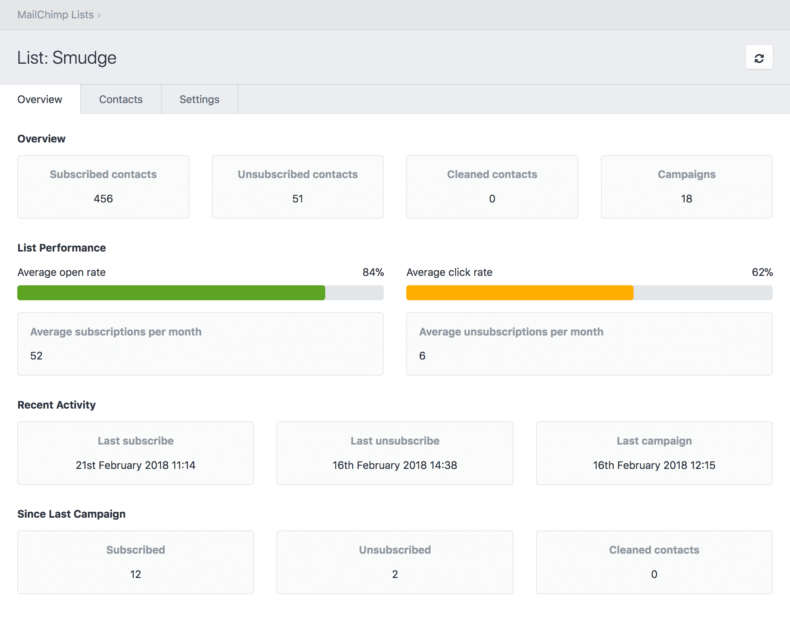

# MailChimp Lists plugin for Craft CMS 3.x

Create, manage and monitor your MailChimp Lists from within Craft.



## Requirements

This plugin requires Craft CMS 3.0.0-RC1 or later.

## Installation

To install the plugin, follow these instructions.

1. Open your terminal and go to your Craft project:

        cd /path/to/project

2. Then tell Composer to load the plugin:

        composer require lukeyouell/craft-mailchimplists

3. In the Control Panel, go to Settings → Plugins and click the “Install” button for MailChimp Lists.

## Configuring MailChimp Lists

You will be required to supply a MailChimp API key which is used to source the relevant data center and authenticate requests.

[Your API key is available here](https://admin.mailchimp.com/account/api-key-popup/).

A [MailChimp](https://mailchimp.com) account is required, if you don't already have one [click here to create one](https://mailchimp.com/signup).

Free & paid plans are available.

## Using MailChimp Lists

Once you have provided the plugin with your MailChimp API key you will be able to create, manage and monitor your lists directly from within Craft.

## Example Form

Your list subscription form template should look something like this:

```twig
<form method="post" action="" accept-charset="UTF-8">

  {{ csrfInput() }}
  <input type="hidden" name="action" value="mailchimp-lists/subscribe">
  <input type="hidden" name="redirect" value="{{ 'foo/bar'|hash }}">
  <input type="hidden" name="listId" value="{{ 't74m4dbg9r'|hash }}">
  <input type="hidden" name="status" value="{{ 'subscribed'|hash }}">
  
  <label>Email Address</label>
  <input type="email" name="email_address" placeholder="joe.bloggs@email.com">
  
  <label>First Name</label>
  <input type="text" name="merge_fields[FNAME]" placeholder="Joe">
  
  <label>Last Name</label>
  <input type="text" name="merge_fields[LNAME]" placeholder="Bloggs">
  
  <input type="submit" value="Subscribe">
            
</form>
```

### Form Parameters

| Name                 | Required | Hashed | Expected value |
| -------------------- | -------- | ------ | -------------- |
| `listId`             | Yes      | Yes    | The unique id for the list |
| `status`             | Yes      | Yes    | `subscribed`, `unsubscribed`, `cleaned` or `pending` |
| `email_address`      | Yes      | No     | Email address for a subscriber |
| `email_type`         | No       | No     | `html` or `text` |
| `merge_fields[]`     | No       | No     | An individual merge var and value for a member |
| `interests[]`        | No       | No     | The name of this field is the ID of the interest in question. |
| `language`           | No       | No     | If set/detected, the subscriber’s language [ISO 3166 Country Code](https://dev.maxmind.com/geoip/legacy/codes/iso3166/) |
| `vip`                | No       | No     | VIP status for subscriber |
| `location[latitude]` | No       | No     | Subscriber location latitude |
| `listId[longitude]`  | No       | No     | Subscriber location longitude |


The above field names are **case-sensitive**.

### Redirecting After Submit

If you have a `redirect` hidden input, the user will be redirected to it upon successful submission. This must also be a hashed value.

If you **don't** have a `redirect` hidden input, the plugin will respond with json.

### Ajax Submissions

You can optionally post submissions over Ajax if you’d like. Just send a POST request to your site with all of the same data that would normally be sent (except for the `redirect` field)

```javascript
$('form').submit(function(ev) {
  // Prevent the form from actually submitting
  ev.preventDefault();

  // Send it to the server
  $.post({
    url: '/',
    dataType: 'json',
    data: $(this).serialize(),
    success: function(response) {
      if (response.success && response.statusCode == 200) {
        alert('Success!');
      } else if (response.statusCode !== 200) {
        alert('MailChimp error: ' + response.body.title)
      } else {
        alert('An error occurred. Please try again.');
      }
    }
  });
});
```

## Example Responses

### Successful

```json
{
   "success": true,
   "statusCode": 200,
   "reason": "OK",
   "body": {
      "id": "24d2b4y97c4fe95a2d6a3d3ba2018cb0",
      "email_address": "joe.bloggs@email.com",
      "unique_email_id": "84a5q243cd",
      "email_type": "html",
      "status": "subscribed",
      "merge_fields": {
         "FNAME": "Joe",
         "LNAME": "Bloggs",
      },
      "stats": {
         "avg_open_rate": 0,
         "avg_click_rate": 0
      },
      "ip_signup": "",
      "timestamp_signup": "",
      "ip_opt": "8.8.8.8",
      "timestamp_opt": "2018-02-21T13:37:36+00:00",
      "member_rating": 2,
      "last_changed": "2018-02-21T13:37:36+00:00",
      "language": "",
      "vip": false,
      "email_client": "",
      "location": {
         "latitude": 0,
         "longitude": 0,
         "gmtoff": 0,
         "dstoff": 0,
         "country_code": "",
         "timezone": ""
      },
      "list_id": "t74m4dbg9r"
   }
}
```

### MailChimp Error

```json
{
   "success": true,
   "statusCode": 400,
   "reason": "Bad Request",
   "body": {
      "type": "http://developer.mailchimp.com/documentation/mailchimp/guides/error-glossary/",
      "title": "Member Exists",
      "status": 400,
      "detail": "joe.bloggs@email.com is already a list member. Use PUT to insert or update list members.",
      "instance": "a6d8eac9-3456-123a-a01b-22r4342d6432"
   }
}
```

### Request Failed

```json
{
   "success": false,
   "reason": "cURL error 6: Could not resolve host: us17.api.mailchimp.co.uk (see http://curl.haxx.se/libcurl/c/libcurl-errors.html)"
}
```

## Overriding Plugin Settings

If you create a [config file](https://craftcms.com/docs/config-settings) in your config folder called `mailchimp-lists.php`, you can override the plugin’s settings in the Control Panel. Since that config file is fully [multi-environment](https://craftcms.com/docs/multi-environment-configs) aware, this is a handy way to have different settings across multiple environments.

Here’s what that config file might look like along with a list of all of the possible values you can override.

```php
<?php

return [
    'apiKey' => '',
];
```

## MailChimp Lists Roadmap

Some things to do, and ideas for potential features:

* Delete Lists
* Edit Members
* Delete Members

Brought to you by [Luke Youell](https://github.com/lukeyouell)
